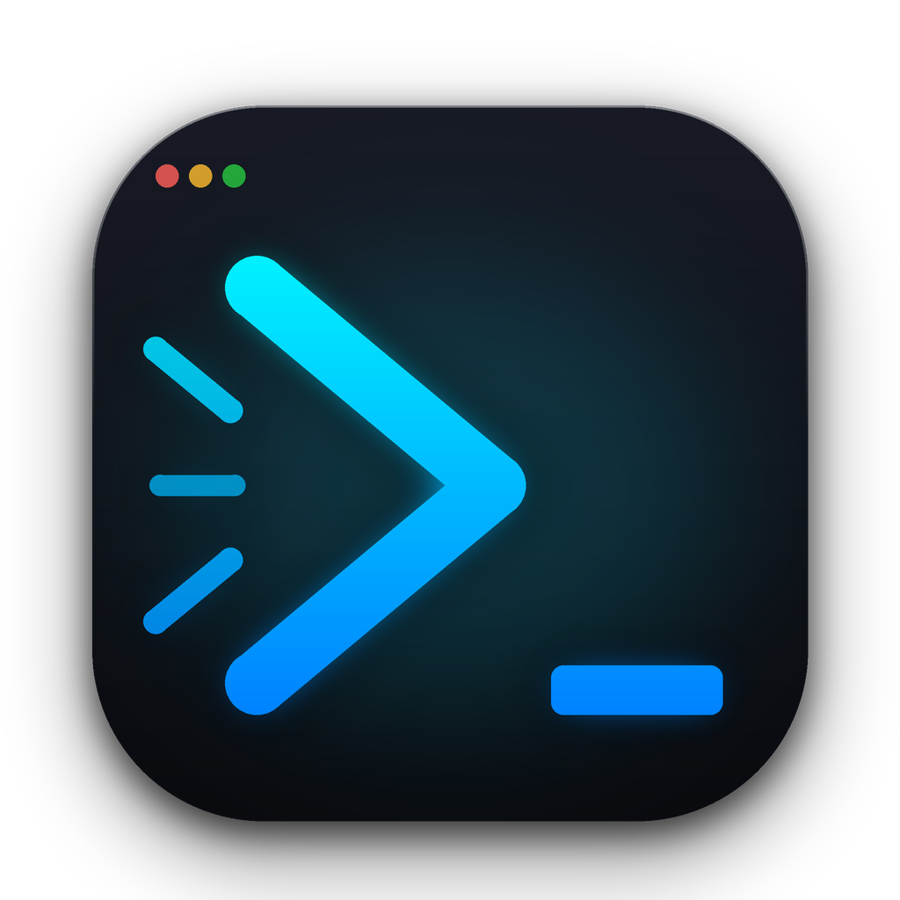

# ⚡ CelerTerm

<p align="center">
  
</p>

<h3 align="center">High-Performance Minimalist GPU-Accelerated Terminal Workspace</h3>

<p align="center">
  <strong>Native Desktop (macOS, Linux) built in pure Rust 2024</strong><br/>
  Ultra-fast, zero-bloat terminal engineered with wgpu, cosmic-text font shaping, and multi-workspace session tabs.
</p>

<p align="center">
  <a href="https://github.com/AMSComm/CelerTerm/releases"></a>
  <a href="./LICENSE"></a>
  
  
  
</p>

---

## 💡 Why CelerTerm?

Traditional terminal emulators either carry heavy Web / Electron runtimes with hundred-megabyte footprints, or lack integrated modern workspace and session management. **CelerTerm** is built from the ground up in pure Rust:

| Metric / Feature | Electron Terminals (Hyper) | Heavy GUI Terminals | ⚡ CelerTerm |
|:---|:---:|:---:|:---:|
| **Memory Footprint** | ~200MB - 500MB | ~120MB - 300MB | **< 35MB** (Zero runtime bloat) |
| **Cold Start** | ~1.5s - 3.0s | ~0.5s - 1.2s | **< 0.15s** (Instant native launch) |
| **Text Shaping & Ligatures** | HTML / Web Canvas | Heavy C/C++ engine | **Cosmic-Text + Nerd Font Symbols** |
| **Workspace Management** | Plugin / External | Flat tabs or separate windows | **Built-in Workspace Manager (`Cmd+Shift+O`)** |
| **Session Persistence** | Lost or Partial | Manual config | **Automatic Snapshot & Scrollback Persistence** |
| **IME Support (VN / JP)** | Inconsistent popup placement | Basic | **Native macOS Anchored IME Composition** |
| **In-App Updates** | None or OS package | None / Manual download | **Interactive GitHub Release Modal (`Cmd+Shift+U`)** |

---

## ✨ Key Features Showcase

### 1. ⚡ Blazing Fast Pure Rust Terminal Engine
- Zero runtime bloat, powered by `alacritty_terminal`, `softbuffer`, and `cosmic-text` text shaping.
- Beautiful Tokyo Night dark theme default (`#1A1B26`), full 24-bit TrueColor support, ANSI 256 colors, and crisp Unicode box-drawing glyphs.
- Sub-millisecond input-to-screen response with low-latency window event dispatch.

### 2. 🗂 Multi-Workspace & Integrated Titlebar Tabs
- **Native Tabs in Titlebar**: Dynamic tab sizing (`tabs_in_titlebar = true`), fast switching (`Cmd/Alt + 1..9`), and new tab (`Cmd/Ctrl + T`).
- **Workspace Manager (`Cmd+Shift+O` / `Ctrl+Shift+O`)**: Group tabs into named workspace sessions, rename, delete, switch between sessions, or spawn them into isolated windows.
- **Session Persistence**: Automatic snapshot persistence across app restarts with scrollback preservation.

### 3. 🔄 In-App Menu & Interactive Update Checker
- **Quick Menu**: Top-right `☰` App Menu with fast access to updates, workspace manager, config reloading, and repository links.
- **Check for Updates (`Cmd+Shift+U` / `Ctrl+Shift+U`)**: Interactive modal checking GitHub API (`AMSComm/CelerTerm`) with scrollable release notes and one-click GitHub download links.

### 4. 🇻🇳 First-Class IME & Native Keyboard Integration
- Native macOS IME composition window anchoring for Vietnamese (Telex, VNI) and Japanese input methods.
- Configurable `option_as_alt` for seamless terminal word navigation (`Alt + Backspace`, `Alt + b/f`) and full Neovim compatibility.

---

## ⌨️ Keyboard Shortcuts

| Action | macOS Shortcut | Linux / Windows Shortcut |
| :--- | :--- | :--- |
| **New Tab** | `Cmd + T` | `Ctrl + Shift + T` |
| **Close Tab** | `Cmd + W` | `Ctrl + Shift + W` |
| **Select Tab (1..9)** | `Cmd + 1` .. `Cmd + 9` | `Alt + 1` .. `Alt + 9` |
| **Previous Tab** | `Cmd + Left` or `Cmd + Shift + [` | `Ctrl + PageUp` |
| **Next Tab** | `Cmd + Right` or `Cmd + Shift + ]` | `Ctrl + PageDown` |
| **Move Tab Left** | `Cmd + Up` | `Ctrl + Shift + Up` |
| **Move Tab Right** | `Cmd + Down` | `Ctrl + Shift + Down` |
| **Workspace Manager** | `Cmd + Shift + O` | `Ctrl + Shift + O` |
| **New Workspace** | `Cmd + Shift + N` | `Ctrl + Shift + N` |
| **Check for Updates** | `Cmd + Shift + U` | `Ctrl + Shift + U` |
| **Reload Config** | `Cmd + Shift + R` | `Ctrl + Shift + R` |
| **Copy Selection** | `Cmd + C` | `Ctrl + Shift + C` |
| **Paste Clipboard** | `Cmd + V` | `Ctrl + Shift + V` |
| **Clear Screen** | `Cmd + K` | `Ctrl + L` |
| **Reset Terminal** | `Cmd + Alt + K` | `Ctrl + Shift + K` |

---

## ⚙️ Configuration

CelerTerm configuration is stored in `~/.config/celerterm/config.toml` (or `~/Library/Application Support/celerterm/config.toml` on macOS).

```toml
[font]
family = "JetBrainsMono Nerd Font"
fallback_families = ["Menlo", "Monaco", "Courier New"]
size = 13.0
line_height = 1.2
ligatures = true

[window]
padding_x = 10.0
padding_y = 6.0
hide_traffic_lights = false
tabs_in_titlebar = true

[workspace]
restore_on_startup = true
save_scrollback = true
max_scrollback_lines = 1000

[macos]
option_as_alt = true
```

---

## 📥 Download & Installation

Download official pre-built packages from [GitHub Releases](https://github.com/AMSComm/CelerTerm/releases):

- **macOS**: `CelerTerm-macOS.dmg` and standalone `CelerTerm-macOS.app.zip`.
- **Linux**: `celerterm-linux-x86_64.tar.gz` and Debian package `.deb`.

> 🔄 **In-App Update Checker:** You can check for new releases and view full changelogs directly inside CelerTerm via the top-right `☰` App Menu or `Cmd+Shift+U` / `Ctrl+Shift+U`.

---

## 🛠️ Building from Source

### Prerequisites

- [Rust](https://rustup.rs/) (version 1.85+ recommended for Rust 2024 edition).
- macOS: Xcode Command Line Tools.
- Linux (Ubuntu/Debian):
  ```bash
  sudo apt-get update && sudo apt-get install -y pkg-config libfontconfig1-dev libx11-dev libxkbcommon-dev libxcb-xfixes0-dev
  ```

### Build & Run

```bash
# Clone the repository
git clone https://github.com/AMSComm/CelerTerm.git
cd CelerTerm

# Run automated tests
cargo test

# Build and run release binary
cargo run --release
```

---

## 🏗️ Architecture & Project Structure

```
celerterm/
├── .github/workflows/
│   ├── release.yml             # Multi-platform release automation (macOS DMG & Linux deb/tar.gz)
│   └── sync-release-notes.yml  # On-demand GitHub Release notes sync from CHANGELOG.md
├── assets/                     # App icon (.icns, .png), Info.plist, and Linux .desktop entry
├── src/
│   ├── app.rs                  # Application state, header rendering, modals & event loop
│   ├── config.rs               # TOML configuration loader & watcher
│   ├── pty.rs                  # PTY process spawner & async I/O bridge
│   ├── render/                 # Cosmic-text shaping, box-drawing glyphs & softbuffer surface
│   ├── term/                   # Terminal emulation grid, scrollback & keymap translator
│   ├── update.rs               # In-app GitHub release checker & SemVer comparator
│   ├── window/                 # Window creation, macOS titlebar integration & layout geometry
│   └── workspace/              # Multi-workspace state manager & disk snapshot persistence
├── tests/                      # Comprehensive integration test suite (68 tests)
├── CHANGELOG.md                # Standardized Keep a Changelog documentation
├── Cargo.toml                  # Rust package manifest & dependencies
└── LICENSE                     # MIT License
```

---

## 📄 License & Author

This project is licensed under the **MIT License** — see the [LICENSE](./LICENSE) file for details.

Developed and maintained by **[AM Software](https://amsoftware.com.vn)**. Copyright © 2026 **AM Software**. All rights reserved.
